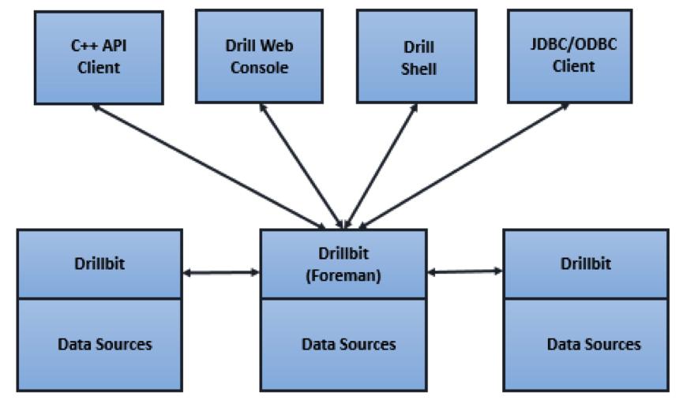
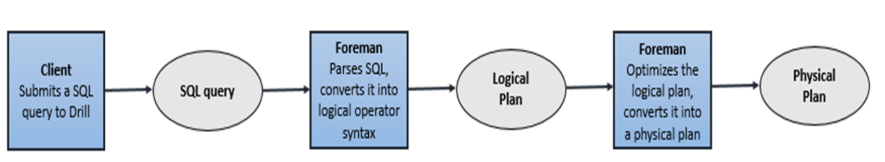
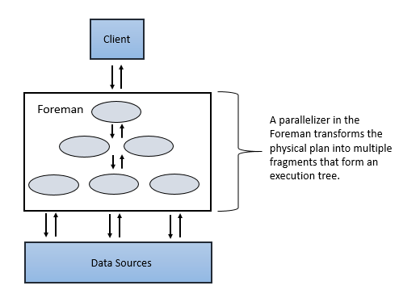
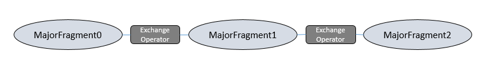
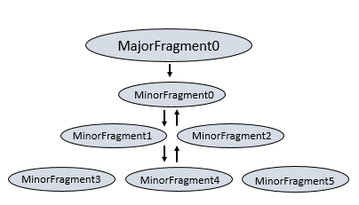
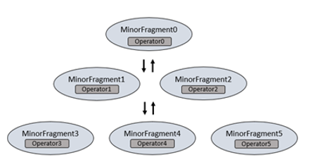
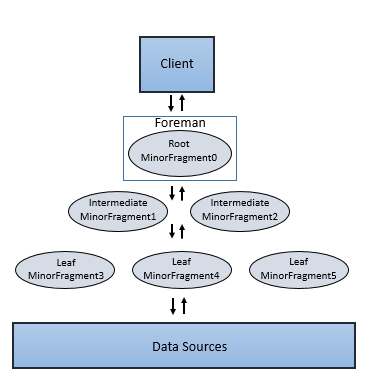

# Apache Drill 调研学习

## 一、Drill概述

在大数据时代，对于Hadoop中的信息，越来越多的用户需要能够获得快速且互动的分析方法。大数据面临的一个很大的问题是大多数分析查询都很缓慢且非交互式。目前来看，MapReduce通常用于执行Hadoop数据上的批处理分析，但并不适合于你想快速得到结果或者重新定义查询参数。Google的Dremel能以极快的速度处理网络规模的海量数据。据谷歌的研究报告显示，Dremel能以拍字节（petabyte，PB，1PB等于1024TB）的数量级来进行查询，而且只需几秒钟时间就能完成。而其对应的开源版本就是Drill。（ps：drill其实就是一个分布式实时数据分析查询的引擎。Drill，一个专为互动分析大型数据集的分布式系统。）
Apache Drill是一个低延迟的分布式海量数据（涵盖结构化、半结构化以及嵌套数据）交互式查询引擎，使用ANSI SQL兼容语法，支持本地文件、HDFS、HBase、MongoDB等后端存储，支持Parquet、JSON、CSV、TSV、PSV等数据格式。本质上Apache Drill是一个分布式的mpp（大规模并行处理）查询层。Drill的目的在于支持更广泛的数据源，数据格式，以及查询语言。受Google的Dremel启发，Drill满足上千节点的PB级别数据的交互式商业智能分析场景。

## 二、GoolDremal设计思想

随着Hadoop的流行，大规模的数据分析系统已经越来越普及。数据分析师需要一个能将数据玩转的交互式系统。如此就可以非常便捷的浏览数据建立分析模型。Dremal有一下几个主要特点：

1.	Dremal是一个大规模系统。在一个PB级别的数据集上面将任务缩短到秒级别，无疑需要大量的并发。磁盘的顺序读写在100mb/s上下，那么在一秒内处理1TB数据则意味着最少要1万个磁盘的，但是机器越多就越容易出问题，如此大的集群需要有足够的容错考虑，保证分析速度不被坏节点影响。

2.	Dremal是MR交互式能力不足的补充。和MR一样，Dremal也需要和数据运行在一起，将计算移动到数据上面。所以需要像GFS一样文件系统作为存储层。在设计之初，	Dremal并非是MR的替代品，他只是可以非常快的分析，在使用的时候，常常使用它来处理MR的结果集或者建立分析原型。

3.	Dremal的数据集是嵌套的。互联网数据常常是非关系型的。Dremal还需要一个灵活的数据模型，这个模型至关重要。Dremal支持一个嵌套的数据模型，类似于json。而传统的关系模型，由于不可避免的大量join操作，在处理大规模数据的时候，往往是有心无力。

4.	Dremal的数据是列示存储的。使用列示存储可以再查询只需要的那部分数据的时候减少cpu和磁盘的访问量。同时列示存储是压缩友好的，使用压缩可以综合cpu和磁盘，发挥最大效能。

5.	Dremal结合了web搜索和DBMS的技术。首先他借鉴了web搜索中的“查询树”概念，将一个相巨大复杂的查询，分割成较小较简单的查询。大事化小小事化了，能并发的在大量节点上跑。其次和并行DBMS一样，Dremal可以提高一个SQL-like的接口像hive和pig一样。

## 三、Drill的优势

1. 学习成本低
2. 低延迟的SQL查询
3. 动态查询自描述数据文件（json，text，Parquet），MPR-DB/Hbase表，不需要元数据定义的hive元数据。ANSI SQL
4. 嵌套数据支持
5. 与ApacheHive一体化（Hive表和视图的查询，支持所有的Hive文件格式和HiveUDFS）
6. BI/SQL工具集成使用标准的JDBC驱动程序
7. 访问多个数据源
8. 用户自定义UDF
9. 高性能（设计上高吞吐量和低延迟，不使用通用的执行引擎，柱形矢量引擎）

## 四、Drill架构

Drill的核心是DrillBit服务，主要负责接收客户端的请求，处理查询，并将结果返回给客户端。
DrillBit能够安装和运行在hadoop集群中所需要的节点上形成一个分布式环境。当DrillBit运行在集群上的节点上时，能够最大程度的实现数据本地化的执行，不要进行网络和节点间的数据移动。Drill使用Zookeeper来维护和管理集群节点和节点的健康状况。
尽管DrillBit运行在Hadoop集群中，不过他不依赖与hadoop集群，可以运行在任何的分布式系统中。
DrillBit架构如下图所示：

##五、Drill原理

当提交一个Drill查询时，客户端或应用程序以SQL语句的方式发送查询给Drill集群中的DrillBit。DrillBit处理运行在每个活动节点上的查询计划和执行查询，以及跨集群分发查询任务以实现数据本地性的最大化。
DrillBit接收来自客户端和应用程序的Drill查询变成驱动整个查询的Foreman。Foreman解析器解析SQL，将自定义规则应用到特定的SQL操作符转换成特定的Drill理解的逻辑操作语法。集合的逻辑运算符形成逻辑的计划。逻辑计划描述了作业所需要生成的查询结果和定义了数据源与应用操作。
Foreman发送逻辑计划到一个基于优化在一个语句和逻辑读计划的SQL操作的顺序的优化器。优化器使用与各种类型规则的重新整理以及函数的最优化方案。优化器将逻辑计划转换成一个描述如何执行查询的物理计划。
 

Foreman并行化转换的物理计划分为多个阶段，包括主要(Major)和次要(Minor)的Fragment。这些Fragment根据配置的数据源执行并创建多级执行重写查询树，将结果返回给客户端和应用程序。
 

Major Fragment是抽象的概念，代表查询执行的一个阶段。这个阶段由一个或多个操作组成。Drill为每个Major Fragment分配一个MajorFragmentID。
例如，执行两个文件的哈希聚合，Drill为这个计划创建两个Major Fragment，第一个Fragment用于扫描两个文件，第二个Fragment用于数据的聚合。
Drill通过一个交换操作符分离两个Fragment。交换的改变发生在数据所在位置或者物理计划的并行化中。交换是由发送器和接收器组成，允许数据在节点之间移动。
Major Fragment不执行任何的查询任务。每个Major Fragment被划分成一个或多个Minor Fragment，执行实际所需完成的查询操作并返回结果给客户端。
 

每个Major Fragment是由多个minor Fragment并行构成的。一个Minor Fragment是内部运行线程的逻辑作业单元。在Drill中，一个逻辑作业单元也被称为碎片(slice)。Drill产生的执行计划由Minor Fragment组成。Drill为每个Minor Fragment分配一个Minor FragmentID。
Foreman的并行器在执行期间从Major Fragment创建一个或多个Minor Fragment,分解的Major Fragment与多个Minor Fragment一样能同时运行在集群上。
 
 
Drill能够尽快的根据上游的数据需求来执行每个Minor Fragment。Drill使用节点的本地化调度Minor Fragment，然后Drill采用轮训的方式调度存在、可用的DrillBit。
Minor Fragment包含一个或多个关系操作，一种操作执行一个关系操作，例如，scan、filter、join、group等。每种操作都有特定的操作类型和一个操作ID。每个操作D定义了它所在的Minor Fragment的关系。
 
 

例如，当执行两个文件的散列聚集时，Drill拆分第一阶段致力于扫描进两个Minor Fragment。每个Minor Fragment 包含扫描文件的扫描操作符。Drill拆分第二阶段为了聚集进四个Minor Fragment。四个Minor Fragment都包括散列聚集操作符。
Minor Fragment可以作为root、intermediate、leaf Fragment三种类型运行。一个执行树只包括一个root Fragment。执行树的坐标编号是从root开始的，root是0。数据流是从下游的leaf Fragment到root Fragment。

运行在Foreman的root Fragment接收传入的查询、从表读取元数据，重新查询并且路由到下一级服务树。下一级的Fragment包括Intermediate 和leaf Fragment。
当数据可用或者能从其他的Fragment提供时，Intermediate Fragment启动作业。他们执行数据操作并且发送数据到下游处理。通过聚合Root Fragment的结果数据，进行进一步聚合并提供查询结果给客户端或应用程序。
 Leaf Fragment并行扫描表并且与存储层数据通信或者访问本地磁盘数据。Leaf Fragment的部分结果传递给Intermediate Fragment，然后对Intermediate结果执行合并操作。
 

##六、总结

###6.1 drill优缺点对比

经过一天的调研与其他同类型技术的对比，drill给我的感觉，首先是实时交互式SQL分布式查询引擎。适用于实时的数据分析查询。

首先说说drill的优点：

1.	支持自定义的嵌套数据集，数据灵活。
2.	Hive一体化，完全支持hive包括hive的udf，并且支持自定义udf
3.	低延迟的sql查询，与常用sql有些不同，不过学习成本较低
4.	支持多数据源
5.	性能较高。

再来看看drill的缺点：

1．	drill语法和常规sql有区别,一般是如“select * from 插件名.表名”的形式。主要是因为drill查询不同数据源时需要切换不同的插件。下面分别是hive，hbase，文件系统三种数据源时候的查询sql。
a)	hvie：select * from hive.test01;
b)	hbase：select * from hbase.test01; 
c)	dfs：select * from dfs.`/home/liking/test.csv`;查出来之后是一列数据，若想对数据查询不同的列需要用columns[0]的形式来标记。
Select columns[0] from dfs.`/home/liking/test.csv`。另外匹配的文件类型需要在插件的工作空间来配置，具体的配置请参考官方文档。
2．	技术线太长，不容易切合到实际生产线上去。
3．	国内使用较少，没有大型成功案例，不够大众化，出现问题可能维护起来比较困难。资料比较少。

###6.2 其他同类型技术简单介绍

1.Apache Kylin：核心思想是预计算，在查询之前建立好索引，以便提高查询速度。Kylin从数据仓库中最常用的Hive中读取源数据，使用 MapReduce作为Cube构建的引擎，并把预计算结果保存在HBase中，对外暴露Rest API/JDBC/ODBC的查询接口。因为Kylin支持标准的ANSI SQL，所以可以和常用分析工具（如Tableau、Excel等）进行无缝对接。
美团、京东、百度等互联网公司都有使用。e最大有8个维度，最大数据条数4亿，最大存储空间800G，30个Cube共占存储空间4T左右。查询性能上，当QPS在50左右，所有查询平均在200ms以内，当QPS在200左右，平均响应时间在1s以内。但从性能来讲没有问题，但他需要预计算，数十gb的文件大概需要几十分钟。对于实时性高的应用场景不能忍受。

2.Impala：基于hive的实时分布式查询引擎。与hive公用元数据库信息，但对udf的结合不够好，而且在嵌套数据的处理上也有问题。不过对于简单的查询来说效果可以。相比于drill，Impala需要定义模式。相对来说适合模式固定，查询条件简答的实时查询。

3.presto：京东，美团都有使用。缺点是学习成本较高，语法语义有问题。Facebook开源的没有权限控制，京东发布的版本有，但是不知道维护起来是否困难。有书可以参考。强类型不支持类型转换，京东版本做了类型转换，不过facebook没有接受京东的代码。所有处理都在内存中完成，本身是有内存限制的，但京东通过提高少量节点的内存，将大资源的任务的数据限制在高性能节点上来提高集群的性能瓶颈。

6.3在实际问题中的表现和评估：
Drill的评估有这几方面需要考虑。对复杂语法的支持，在大数据情况下多表性能如何，提供接口是否易用。
Drill：用于Hadoop，NoSQL和云存储的无模式SQL查询引擎
Drill：
1.支持ANSI SQL2003，完全兼容标准的sql，支持复杂的查询如where的子查询和join，但是好像不支持insert，update，delete。只是负责提供查询数据。

2.支持查询各种非关系型数据库以及各类文件系统（没有说能不能查询关系型数据库）。支持数据本地化，可以将存储节点与drill放在一起。

3．提供三种操作接口，webui，shell，编程。提供java和c++的编程接口。编程中使用drill驱动类即可。org.apache.drill.jdbc.Driver

发现的问题：1.第一次查询速度大速度降低，以后会变快。可能是受测试环境拖累。

2.问题：Java 1.7 or later is required to run Apache Drill.明明是1.8的jdk版本却报版本过低的错误。定位到drill-config.sh 396行。发现没有对”.”进行转义造成。
加上转义符，转义后解决。

3：在连接hbase时可以连接到数据库的原信息，但是执行sql时却报错。
错误信息：
 	Query Failed: An Error Occurred
org.apache.drill.common.exceptions.UserRemoteException: SYSTEM ERROR:
 	IllegalAccessError: tried to access method	
com.google.common.base.Stopwatch.()V
  	from class org.apache.hadoop.hbase.zookeeper.MetaTableLocator
  	[Error Id: 225f9409-3be7-42f2-be6d-4cabe21bc518 on sengtest:31010]
开始怀疑是HBASE版本问题,找了一个0.98版本，同样的问题。
问题定位在drill的jar上面去。
 
下载HBASE Shaded Client 替换即可，下载地址： http://mvnrepository.com/artifact/org.apache.hbase/hbase-shaded-client/1.2.3
将这四个jar包
 hbase-annotations-1.1.3.jar  、hbase-client-1.1.3.jar
hbase-common-1.1.3.jar    、hbase-protocol-1.1.3.jar
替换成
hbase-shaded-client-1.2.3.jar
问题解决。
注意：从drill 1.17的release nodes上面可以看到drill已经可以适配1.x版本的hbase。

4：连接hive时可以正确访问元数据，执行sql查询时出错。报unknowhost，因为元数据正常访问，说明插件配置没有问题，问题定位到hdfs-site.xml。发现配置的ha，namenode无法被识别。暂时解决办法：在客户端配置namenode的host映射。弊端：对于ha的namenode如果主备切换之后可能还需要再配置。

通过jdbc连接drill：通过jdbc连接drill需要注意的是jar包引入和连接的方式。
Drill的jdbc maven依赖

	<dependency>
   	 		<groupId>org.apache.drill.exec</groupId>
   	 		<artifactId>drill-jdbc-all</artifactId>
   	 		<version>1.11.0</version>
	</dependency>
	
Dril的连接方式有两种，一是制定具体的drill或者drill集群的ip和端口号。另一种是通过zk来完成。两种方式的具体格式如下：如有更深入的需求可以上官网查看。

	Drillbit：jdbc:drill:drillbit=<node name>[:<port>][,<node name2>[:<port>]...
	DrillZK：jdbc:drill:zk=<zk name>[:<port>][,<zk name2>[:<port>]...

jdbc连接时，查询hbase与文件系统均返回varchar类型。查询hive时支持大部分数据类型，现在并不提供对于hive的写操作。不支持的hive数据类型有：List，Map STRUCT，TIMESTAMP（Unix Epoch format），UNION
下面来说一下查询hive时支持的数据类型与sql的映射。

	支持的SQL类型	Hive类型
	BIGINT		BIGINT
	BOOLEAN		BOOLEAN
	VARCHAR		CHAR
	DATE		DATE
	DECIMAL*	DECIMAL
	FLOAT		FLOAT
	DOUBLE		DOUBLE
	INTEGER		INT,TINYINT,SMALLINT
	INTERVAL	N/A
	TIME		N/A
	N/A			TIMESPAMP　　(unix的系统时间)
	TIMESPAMP	TIMESPAMP　　(JDBC时间格式：yyyy-mm-dd hh:mm:ss)
	None		STRING
	VARCHAR		VARCHAR
	VARBINARY	BINARY

参考文档：https://www.cnblogs.com/smartloli/p/5002435.html

官网地址：http://drill.apache.org/
